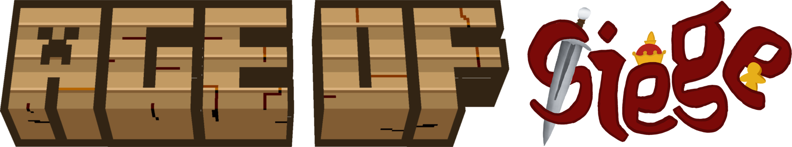

<p align="center"></p>

<h1 align="center">Age of Siege <br>
    <a href="https://github.com/junyali/ageofsiege/actions/workflows/build.yml"></a>
    <a href="https://github.com/junyali/ageofsiege/releases/"></a>
    <a href="https://github.com/junyali/ageofsiege/blob/main/LICENSE"></a>
    <br><br>
</h1>

<p><b>⚠️ Active development - some stuff might be waffle :P</b></p>
<p>Age of Siege is a small content mod adding a variety of medieval rations and fortifications to improve your middle age survival experience!</p>

<h2 align="center">Gallery <br><br>
    
    
    
</h2>

<h2 align="center">Development</h2>
<p>
    <b>Currently added:</b>
    <ul>
        <li>Crate storage block</li>
        <li>Salt (yay?)</li>
        <li>Food items</li>
    </ul>
    <b>To be added:</b>
    <ul>
        <li>Medieval weapons!!</li>
        <li>Medieval structure blocks like spiked fences</li>
        <li>idk bleh</li>
    </ul>
</p>

<h2 align="center">How to run / build <br></h2>
<h3>Requirements</h3>
<p><b>NeoForge: </b>This mod was built on NeoForge version 21.1.173 for 1.21.1</p>
<h3>Running</h3>
<p>Download the latest release <a href="https://github.com/junyali/arsenalandanvil/releases">here</a>.</p>
<h3>Building</h3>
<p>This mod was developed on IntelliJ IDEA Ultimate, though may work with other Java IDEs that support the Gradle Build Tool</p>
<p>Importing from `build.gradle`, run:</p>

```console
$ ./gradlew
```
